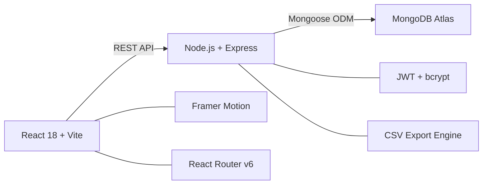

# VORTEX ARENA
## Gaming Arena Management System — Client Presentation

**Presented by:** [Your Name]  
**Date:** March 6, 2026  
**Technology:** Full-Stack Web Application (MERN Stack)

---

# 🎯 The Problem

Gaming cafés, esports lounges, and entertainment venues face **critical operational challenges**:

| Challenge | Impact |
|-----------|--------|
| **Manual booking management** | Overbookings, missed slots, customer frustration |
| **No real-time station tracking** | Staff can't tell which stations are free or occupied |
| **Paper-based billing** | Revenue leaks, no payment history, error-prone calculations |
| **Zero analytics** | Owners have no visibility into revenue trends, popular games, or peak hours |
| **No customer self-service** | Every booking requires staff intervention — long queues, lost customers |
| **Multi-role chaos** | Admins, staff, and customers share the same unstructured workflow |

> [!CAUTION]
> Gaming cafés without a management system lose an estimated **15–25% revenue** due to unbilled sessions, overbooking conflicts, and inability to track peak hours.

---

# 💡 Our Solution — Vortex Arena

**Vortex Arena** is a **complete, web-based arena management system** that digitizes every aspect of running a gaming venue — from customer self-service bookings to real-time floor monitoring, automated billing, and business analytics.

### One Platform. Three Portals.

```
┌──────────────────────────────────────────────────────┐
│                   VORTEX ARENA                        │
│                                                      │
│   🔴 ADMIN PORTAL      → Full control & analytics   │
│   🔵 STAFF PORTAL      → Daily operations           │
│   🟢 CUSTOMER PORTAL   → Self-service booking       │
│                                                      │
└──────────────────────────────────────────────────────┘
```

---

# 🏗️ System Architecture

```
┌───────────────────────────────────────────────────┐
│              FRONTEND (React + Vite)               │
│  ┌───────────┐ ┌───────────┐ ┌─────────────────┐ │
│  │  Admin    │ │  Staff    │ │  Customer       │ │
│  │  Panel    │ │  Panel    │ │  Portal         │ │
│  └─────┬─────┘ └─────┬─────┘ └───────┬─────────┘ │
│        └──────────────┼───────────────┘            │
│                       │  REST API (HTTP)           │
└───────────────────────┼───────────────────────────┘
                        │
┌───────────────────────┼───────────────────────────┐
│           BACKEND (Node.js + Express)              │
│                                                    │
│  JWT Authentication │ Role-Based Access Control    │
│  9 Route Modules    │ Mongoose ODM                 │
│  CSV Export Engine   │ Auto-Billing Engine          │
│                                                    │
└───────────────────────┼───────────────────────────┘
                        │
┌───────────────────────┼───────────────────────────┐
│            DATABASE (MongoDB Atlas - Cloud)         │
│                                                    │
│  Users │ Games │ Stations │ Bookings │ Sessions    │
│  Payments                                          │
└───────────────────────────────────────────────────┘
```

---

# ✨ Key Features Walkthrough

---

## 1. 🖥️ Landing Page — First Impressions

A stunning **cyberpunk-themed** public homepage that sells the arena experience.

- ✅ **Hero Section** with gradient text & animated CTA buttons
- ✅ **Live Station Counter** — real-time available stations from database
- ✅ **Game Showcase** — dynamically loaded game catalog
- ✅ **Feature Highlights** — key selling points for visitors
- ✅ **Smart Routing** — "Book Now" auto-redirects guests to login, then returns them to booking

> [!TIP]
> The landing page itself fetches live data — it's not a static template. Station availability updates in real-time.

---

## 2. 🔐 Authentication System

### Secure, Role-Based Login & Registration

| Feature | Details |
|---------|---------|
| **JWT Authentication** | Stateless tokens, 7-day expiry |
| **Password Security** | bcrypt hashing with salt |
| **Smart Redirect** | After login → role-specific dashboard |
| **Auto-Login** | New registrations are instantly logged in |
| **Session Persistence** | Token stored securely, auto-attached to all API calls |
| **401 Auto-Logout** | Expired tokens trigger automatic logout |

### Role-Based Access Control (RBAC)

| Capability | Admin | Staff | Customer |
|------------|:-----:|:-----:|:--------:|
| Full Dashboard & Analytics | ✅ | — | — |
| Manage Users, Games, Stations | ✅ | — | — |
| Start/End Sessions | ✅ | ✅ | — |
| Manage Bookings & Payments | ✅ | ✅ | — |
| Self-Service Booking | ✅ | — | ✅ |
| View Own Bookings & Profile | ✅ | ✅ | ✅ |
| Reports & Data Export (CSV) | ✅ | — | — |

---

## 3. 📊 Admin Dashboard — Command Center

The admin dashboard is a **real-time operations hub** displaying everything at a glance.

### What it shows:

| Widget | Purpose |
|--------|---------|
| **Today's Revenue** | Total revenue collected today + pending count |
| **Active Sessions** | Currently running sessions + station utilization % |
| **Pending Collection** | Unpaid bills — clickable to jump to billing |
| **Total Bookings** | Lifetime booking count + total registered users |
| **Live Sessions Feed** | Active sessions with customer, game, timer |
| **Station Usage Chart** | Bar chart — PC vs Console vs VR vs Simulator utilization |
| **Weekly Revenue Chart** | 7-day animated revenue bars |
| **Top Games Ranking** | Most-booked games with medal icons 🥇🥈🥉 |
| **Activity Feed** | Chronological log of recent actions |

> [!IMPORTANT]
> The dashboard is **not a static report** — it shows **live data** and refreshes periodically. Active session timers count down in real-time.

---

## 4. 🎮 Game & Station Management

### Game Management
- Visual card grid of all games in the catalog
- Add/Edit/Delete with title, genre, platform, description, image
- Platform tagging (PC, PlayStation, Xbox, VR)
- Search & filter by genre or platform

### Station Management
- Complete station inventory with **type**, **hourly pricing**, and **live status**
- Status indicators: 🟢 Available | 🔴 In Use | ⚫ Offline
- Station types: PC, Console, VR, Simulator
- Pricing auto-populates into bookings & sessions

---

## 5. ⏱️ Session Management — Daily Operations Core

This is the **most-used feature** during daily operations.

### How it works:
1. Staff sees a **visual grid of all stations** with live status
2. Click an **available station** → opens "Start Session" modal
3. Enter customer name (walk-in) or select registered user
4. Select game, duration → price auto-calculated
5. Click **Start** → station turns red, timer begins
6. Click **End Session** → bill auto-generated, station turns green

### Key capabilities:
- ✅ **Walk-in support** — no pre-booking required
- ✅ **Session extension** — add time mid-session
- ✅ **Auto-billing** — payment record created automatically when session ends
- ✅ **Live timers** — real-time countdown on every active station
- ✅ **Status sync** — station status updates across all panels instantly

---

## 6. 🗺️ Interactive Floor Map — Live Arena View

A **visual, real-time map** of the entire gaming arena.

- Color-coded station cards with **glowing effects**
  - 🟢 Green glow = Available
  - 🔴 Red glow = In Use (shows customer, game, time remaining)
  - ⚫ Dark = Offline
- **Station type icons** — Monitor, Gamepad, VR Headset, Simulator
- **Fullscreen mode** — ideal for wall-mounted TVs in the arena
- **Auto-refresh** every 30 seconds
- **Station count summary** bar at top

> [!TIP]
> Put this on a large TV in the arena — customers can see available stations themselves, staff can manage walk-ins faster.

---

## 7. 📅 Smart Booking System

### Customer Self-Service Flow (5 Steps):

```
Step 1          Step 2          Step 3          Step 4          Step 5
┌─────────┐    ┌─────────┐    ┌─────────┐    ┌─────────┐    ┌─────────┐
│ Choose   │ →  │ Choose  │ →  │ Select  │ →  │ Choose  │ →  │ Review  │
│ Game     │    │ Station │    │ Date &  │    │Duration │    │& Confirm│
│          │    │         │    │ Time    │    │ 1-4 hrs │    │         │
└─────────┘    └─────────┘    └─────────┘    └─────────┘    └─────────┘
```

### Admin Booking Management:
- Full table view with **status tabs** (Pending → Confirmed → Active → Completed → Cancelled)
- **Context-sensitive actions** — Start Session / End Session / Cancel
- **Detail slide-over** panel with complete booking info
- **Search** across customer, game, or station name

---

## 8. 💰 Payment & Billing System

| Feature | Details |
|---------|---------|
| **Auto-Generated Bills** | Created automatically from bookings & sessions |
| **4 Payment Methods** | 💵 Cash · 📱 UPI · 💳 Card · 🌐 Online |
| **Partial Payments** | Track paid vs remaining amounts |
| **Date-Based View** | Filter bills by date (defaults to today) |
| **Quick Collect** | One-click "Collect Full Amount" button |
| **Status Tracking** | ✅ Paid · ⚠️ Pending with color-coded badges |

---

## 9. 📈 Reports & Analytics

### Three Reporting Modes:

| Mode | Use Case |
|------|----------|
| **Daily Report** | View stats + booking table for any specific date |
| **Monthly Report** | Aggregate revenue, bookings, sessions, payments |
| **Custom Range** | Specify start/end dates for custom period analysis |

### Includes:
- Revenue, Bookings, Sessions, Payments **stat cards**
- **Weekly Revenue chart** — animated bar chart
- **Top Games ranking** — most-booked games with 🥇🥈🥉
- **CSV Export** — download Booking Data + Billing Data for Excel/Sheets

> [!IMPORTANT]
> CSV export enables integration with accounting software — no data is locked inside the application.

---

## 10. ⚙️ Settings & Data Export

- **Date range selection** — From / To pickers (defaults to last 30 days)
- **Booking Data CSV** — Customer, Email, Phone, Game, Station, Date, Time, Duration, Price, Status
- **Billing Data CSV** — Customer, Description, Amount, Paid, Remaining, Method, Status, Transaction ID
- Files are properly formatted for **Excel and Google Sheets**

---

# 🆚 How We Compare — Competitive Analysis

| Feature | Vortex Arena | Manual Register | Generic POS | Competitor Apps |
|---------|:------------:|:---------------:|:-----------:|:---------------:|
| **Multi-Role Access** (Admin/Staff/Customer) | ✅ | ❌ | ❌ | ⚠️ Limited |
| **Customer Self-Service Booking** | ✅ | ❌ | ❌ | ⚠️ Basic |
| **Real-Time Floor Map** | ✅ | ❌ | ❌ | ❌ |
| **Live Session Timers** | ✅ | ❌ | ❌ | ⚠️ Some |
| **Walk-In Session Support** | ✅ | ✅ | ⚠️ | ⚠️ |
| **Auto-Generated Billing** | ✅ | ❌ | ✅ | ⚠️ |
| **Partial Payment Tracking** | ✅ | ❌ | ⚠️ | ❌ |
| **Multi-Mode Reports** (Daily/Monthly/Custom) | ✅ | ❌ | ⚠️ Basic | ⚠️ |
| **CSV Data Export** | ✅ | ❌ | ⚠️ | ⚠️ |
| **Dark Gaming Theme** | ✅ | N/A | ❌ | ⚠️ |
| **Mobile Responsive** | ✅ | N/A | ⚠️ | ⚠️ |
| **No Subscription Fee** (Self-Hosted) | ✅ | ✅ | ❌ Monthly | ❌ Monthly |
| **Full Source Code Ownership** | ✅ | N/A | ❌ | ❌ |
| **Cloud Database (MongoDB Atlas)** | ✅ | ❌ | ⚠️ | ⚠️ |

---

# 🔒 Security Features

| Layer | Implementation |
|-------|----------------|
| **Password Storage** | bcrypt hashing with salt (never stored in plaintext) |
| **Authentication** | JWT tokens with 7-day expiry |
| **Authorization** | Server-side role checks on every API endpoint |
| **Route Protection** | Frontend guards + backend middleware double-check |
| **Input Validation** | Mongoose schema validators + frontend form validation |
| **Duplicate Prevention** | Unique email constraint prevents duplicate accounts |
| **Auto-Logout** | Expired tokens trigger automatic session cleanup |
| **CORS Protection** | Cross-Origin Resource Sharing properly configured |

---

# 🛠️ Technology Stack



| Layer | Technology | Why We Chose It |
|-------|-----------|-----------------|
| **Frontend** | React 18 + Vite | Fast, component-based, huge ecosystem |
| **Styling** | Custom CSS with Dark Theme | Premium cyberpunk aesthetic, fully customizable |
| **Animations** | Framer Motion | Smooth, professional micro-animations |
| **Backend** | Node.js + Express | JavaScript end-to-end, high performance |
| **Database** | MongoDB Atlas (Cloud) | Flexible schema, auto-scaling, zero maintenance |
| **Auth** | JWT + bcrypt | Industry-standard stateless authentication |
| **Icons** | Lucide React | Modern, consistent icon set |

---

# 📐 Database Design — 6 Collections

```
Users ──────┐
            ├── Bookings ──── Payments
Games ──────┤
            │
Stations ───┤
            │
            └── Sessions ──── Payments
```

| Collection | Records | Key Relationships |
|------------|---------|-------------------|
| **Users** | Admin, Staff, Customer profiles | → Bookings, Sessions |
| **Games** | Game catalog (title, genre, platform, image) | → Bookings, Sessions |
| **Stations** | Arena hardware (name, type, price, status) | → Bookings, Sessions |
| **Bookings** | Customer reservations with date/time/duration | → Payments |
| **Sessions** | Active/completed gaming sessions | → Payments |
| **Payments** | All financial transactions | ← Bookings, Sessions |

---

# 🚀 Deployment & Scalability

| Aspect | Details |
|--------|---------|
| **Cloud Database** | MongoDB Atlas — automatic backups, scaling, zero ops |
| **Frontend Hosting** | Vercel / Netlify (free tier available) |
| **Backend Hosting** | Render / Railway / AWS (auto-deploy from Git) |
| **Easy Setup** | Clone → `npm install` → configure `.env` → `npm run dev` |
| **No Vendor Lock-In** | Full source code, self-hostable, portable |

---

# 📈 Business Value

### For Arena Owners:
- ✅ **Eliminate revenue leaks** — every session is billed automatically
- ✅ **Data-driven decisions** — know your top games, peak hours, revenue trends
- ✅ **Reduce staff workload** — customers book online, billing is automated
- ✅ **Professional brand image** — premium dark-themed customer portal
- ✅ **Export to Excel** — CSV downloads for accounting & tax purposes

### For Staff:
- ✅ **One-click session management** — start/end sessions from a visual grid
- ✅ **No manual calculations** — pricing is automatic
- ✅ **Walk-in ready** — handle customers without pre-booking
- ✅ **Floor map on TV** — see entire arena status at a glance

### For Customers:
- ✅ **Self-service booking** — browse games, pick stations, choose time slots
- ✅ **No queues** — book from home, just show up and play
- ✅ **Booking history** — track all past and upcoming sessions
- ✅ **Profile management** — update details and change password

---

# 🔮 Future Roadmap

| Feature | Priority | Status |
|---------|----------|--------|
| **Email Notifications** — booking confirmations & reminders | 🔴 High | Planned |
| **Payment Gateway** — Razorpay/Stripe integration | 🔴 High | Planned |
| **Membership Plans** — monthly/yearly subscriptions | 🟡 Medium | Planned |
| **Tournament Mode** — esports tournament management | 🟡 Medium | Planned |
| **Loyalty Program** — points & rewards for regulars | 🟡 Medium | Planned |
| **SMS Alerts** — session expiry reminders | 🟡 Medium | Planned |
| **Multi-Branch** — multiple arena locations | 🟢 Low | Planned |
| **Mobile App** — React Native companion | 🟢 Low | Planned |

---

# 📋 Summary

> **Vortex Arena** is a production-ready, full-stack gaming arena management system that replaces manual processes with an automated, real-time, multi-role platform — delivering immediate value to owners, staff, and customers.

### Key Differentiators:
1. **Three dedicated portals** — Admin, Staff, and Customer each get a tailored experience
2. **Real-time everything** — live floor map, session timers, instant status sync
3. **Zero revenue leaks** — automated billing with partial payment tracking
4. **Self-hosted, no subscription** — one-time setup, full code ownership
5. **Premium UI/UX** — cyberpunk dark theme with smooth animations
6. **Export-ready** — CSV downloads for seamless accounting integration
7. **Scalable architecture** — MERN stack with cloud database, ready for growth

---

*Thank you for your time. Questions?*

---

# 🎤 Speaking Script — What to Say During Presentation

> Use this as a quick guide for what to speak while presenting each section. **Total time: ~3-4 minutes.**

---

### **Opening (30 sec)**

> "Our project is called **Vortex Arena** — it's a complete web-based management system for gaming cafés and esports lounges. Right now, most gaming arenas run on manual registers or basic POS systems, which leads to overbookings, unbilled sessions, and zero business insights. Our system solves all of that."

---

### **What It Does (1 min)**

> "It has **three separate portals**:
> - **Admin** gets a full dashboard with live stats, revenue charts, reports, and CSV exports
> - **Staff** can start/end gaming sessions with one click and collect payments
> - **Customers** can browse games, pick a station, choose a time slot, and book online — no queues needed
>
> The key feature is the **real-time floor map** — you can put it on a TV in the arena and see which stations are free, occupied, or offline, all updating live."

---

### **How It Works (45 sec)**

> "When a customer walks in or books online, the system tracks everything — which station, which game, how long. When the session ends, the **bill is auto-generated**. It supports cash, UPI, card, and online payments, even partial payments. At the end of the day, the admin can pull daily/monthly reports and download CSVs for accounting."

---

### **Tech Stack (30 sec)**

> "We built it on the **MERN stack** — React frontend with Vite, Node.js + Express backend, and MongoDB Atlas cloud database. Authentication uses JWT tokens with bcrypt password hashing. The UI has a premium dark cyberpunk theme with Framer Motion animations."

---

### **Why It's Better (45 sec)**

> "Compared to manual registers — everything is automated and searchable. Compared to generic POS systems — we have gaming-specific features like session timers, floor maps, and game catalogs. Compared to competitor apps — we offer customer self-service booking, real-time station monitoring, and it's **self-hosted with no monthly subscription**. You own the code."

---

### **Closing (15 sec)**

> "In short, Vortex Arena replaces paper registers with a smart, real-time system that increases revenue, reduces staff workload, and gives customers a premium experience. Thank you."

---

**Vortex Arena** — Built with ❤️ using the MERN Stack
